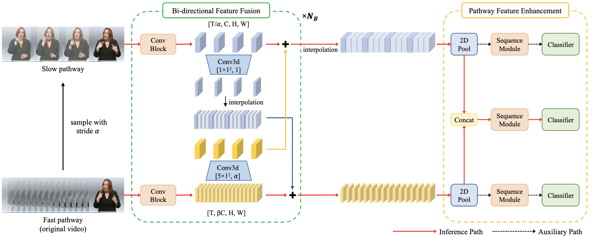

[](https://paperswithcode.com/sota/sign-language-recognition-on-csl-daily?p=slowfast-network-for-continuous-sign-language)

[](https://paperswithcode.com/sota/sign-language-recognition-on-rwth-phoenix?p=slowfast-network-for-continuous-sign-language)

[](https://paperswithcode.com/sota/sign-language-recognition-on-rwth-phoenix-1?p=slowfast-network-for-continuous-sign-language)

# SlowFast Network for Continuous Sign Language Recognition

This repository provides the official pytorch implementation of our paper:

> [SlowFast Network for Continuous Sign Language Recognition](https://ieeexplore.ieee.org/abstract/document/10445841/)
>
> Junseok Ahn, [Youngjoon Jang](https://art-jang.github.io/), [Joon Son Chung](https://mm.kaist.ac.kr/joon/)
>
> Accepted to ICASSP 2024

This repo is based on [VAC (ICCV 2021)](https://github.com/ycmin95/VAC_CSLR), [CorrNet (CVPR 2023)](https://github.com/hulianyuyy/CorrNet), and [PySlowFast](https://github.com/facebookresearch/SlowFast).

## Abstract
<p align='center'>
  
</p>
  <b>
Fig. 1. Overall Architecture. Our framework extracts spatial and dynamic features in parallel using the Slow and Fast pathways. Bi-directional Feature Fusion (BFF) facilitates the exchange of rich information between two pathways. Pathway Feature Enhancement (PFE) amplifies the sequence feature of each pathway by utilising characteristics sourced from different sample rates. 
</b>
<br /> <br />
The objective of this work is the effective extraction of spatial and dynamic features for Continuous Sign Language Recognition (CSLR). To accomplish this, we utilise a two-pathway SlowFast network, where each pathway operates at distinct temporal resolutions to separately capture spatial (hand shapes, facial expressions) and dynamic (movements) information. In addition, we introduce two distinct feature fusion methods, carefully designed for the characteristics of CSLR: (1) Bi-directional Feature Fusion (BFF), which facilitates the transfer of dynamic semantics into spatial semantics and vice versa; and (2) Pathway Feature Enhancement (PFE), which enriches dynamic and spatial representations through auxiliary subnetworks, while avoiding the need for extra inference time. As a result, our model further strengthens spatial and dynamic representations in parallel. We demonstrate that the proposed framework outperforms the current state-of-the-art performance on popular CSLR datasets, including PHOENIX14, PHOENIX14-T, and CSL-Daily.

## Prerequisites
- Python == 3.8
- PyTorch == 1.13
- ctcdecode == 1.0.3 [[parlance/ctcdecode]](https://github.com/parlance/ctcdecode)，for beam search decode.
- You can install other required modules by running  
  `pip install -r requirements.txt`

## Data Preparation
Please follow the instruction in [CorrNet](https://github.com/hulianyuyy/CorrNet) github repo to download and preprocess the datasets (PHOENIX2014, PHOENIX2014-T, CSL-Daily).
The structure of dataset directory is as follows (There may be other additional directories.):
```
dataset
├── phoenix2014
│   └── phoenix-2014-multisigner
│       └── features
│           └── fullFrame-256x256px
├── phoenix2014-T
│   └── features
│       └── fullFrame-256x256px
└── CSL-Daily
    └── sentence
        └── frames_256x256
```

## Inference
Pretrained models can be downloaded from [[Google Drive]](https://drive.google.com/drive/folders/1_gn6g4ZsjzKuhptdzHmDqKoFc3zIYpVf?usp=sharing).
| Dataset       | Dev WER (%) | Test WER (%) |
|:--------------| :-----: | :------: |
| PHOENIX2014   | 18.01 | 18.28 |
| PHOENIX2014-T | 17.66 | 18.71 |
| CSL-Daily     | 25.49 | 24.85 |

To evaluate the pretrained model, run the command below:
```bash
python main.py --device 0 --dataset phoenix2014 --phase test --load-weights ./best_checkpoints/phoenix2014_dev_18.01_test_18.28.pt --work-dir ./work_dir/phoenix2014_test/
```

### Apple Silicon (M1/M2/M3) Support
The code automatically sets the environment variable `PYTORCH_ENABLE_MPS_FALLBACK=1` when running on Apple Silicon devices. This allows operations not supported by MPS (Metal Performance Shaders) to fall back to CPU automatically.

If you encounter errors related to unsupported operations on MPS, you can manually set this environment variable before running the script:

```bash
export PYTORCH_ENABLE_MPS_FALLBACK=1
python main.py --device 0 --dataset phoenix2014 --phase test --load-weights ./best_checkpoints/phoenix2014_dev_18.01_test_18.28.pt --work-dir ./work_dir/phoenix2014_test/
```

Alternatively, you can force CPU-only execution by setting the device to 'cpu':

```bash
python main.py --device cpu --dataset phoenix2014 --phase test --load-weights ./best_checkpoints/phoenix2014_dev_18.01_test_18.28.pt --work-dir ./work_dir/phoenix2014_test/
```

## Training 
Before you start training, download the pre-trained SlowFast pkl file by running the following code:
```bash
mkdir ckpt && cd ckpt
wget https://dl.fbaipublicfiles.com/pyslowfast/model_zoo/ava/pretrain/SLOWFAST_64x2_R101_50_50.pkl
```

To train the SlowFastSign model, run the command below:
```bash
python main.py --device 0 --dataset phoenix2014 --loss-weights Slow=0.25 Fast=0.25 --work-dir ./work_dir/phoenix2014/
```
You can check other arguments for training from `utils/parameters.py`

### Apple Silicon Training
For Apple Silicon users, the same MPS fallback support applies to training as well. You can use the same approaches mentioned in the Inference section:

1. Let the code automatically set the environment variable (default behavior)
2. Manually set the environment variable: `export PYTORCH_ENABLE_MPS_FALLBACK=1`
3. Force CPU-only training: `--device cpu`

Note that training on MPS with fallback to CPU for unsupported operations may be slower than pure CPU training in some cases. If you experience performance issues, try using CPU-only mode.

## Citation
If you find our work useful for your research, please cite our work with the following bibtex:

```bibtex
@inproceedings{ahn2024slowfast,
  author={Ahn, Junseok and Jang, Youngjoon and Chung, Joon Son},
  booktitle={IEEE International Conference on Acoustics, Speech and Signal Processing}, 
  title={Slowfast Network for Continuous Sign Language Recognition}, 
  year={2024},
  pages={3920-3924},
  doi={10.1109/ICASSP48485.2024.10445841}
}
```
